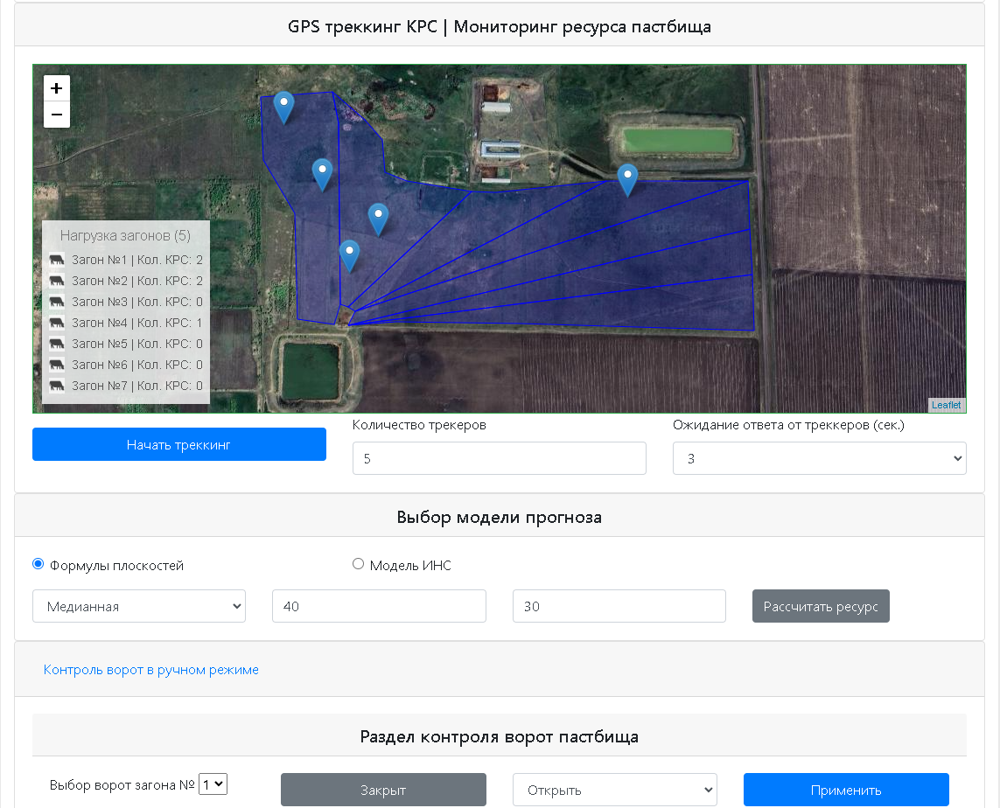

# Pasture Resource and Cattle grazzing Management System

### Description of the System  

<table>
  <tr>
    <td align="center">
       
      Step 1: Initial screen
    </td>
    <td align="center">
       
      Step 2: Select device
    </td>
  </tr>
  <tr>
    <td align="center">
       
      Step 3: Configuration
    </td>
    <td align="center">
       
      Step 4: Apply settings
    </td>
  </tr>
  <!-- Add more rows as needed -->
</table>

### Hardware overview  
