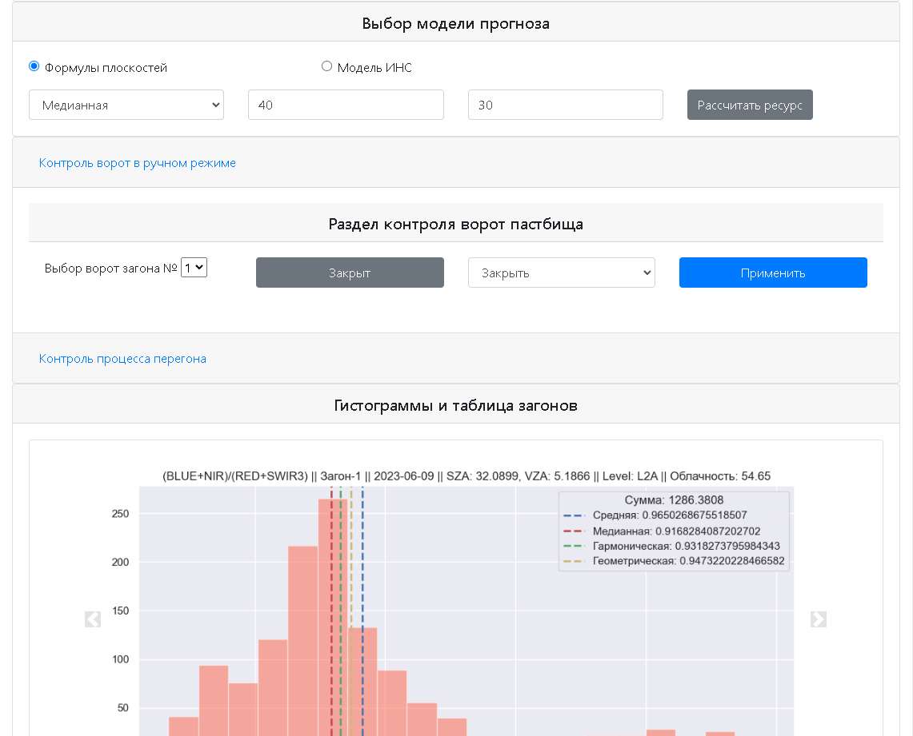
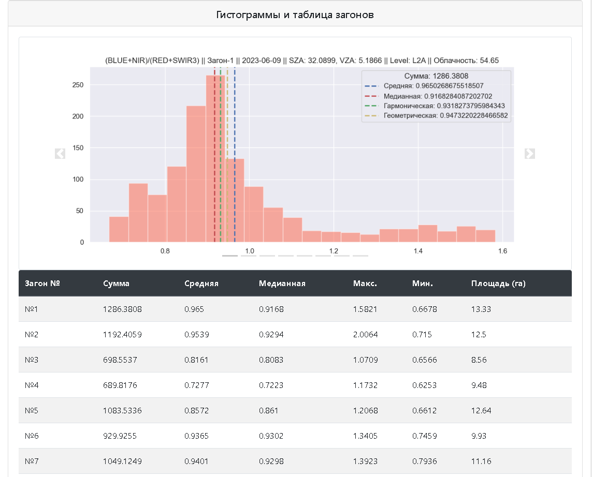
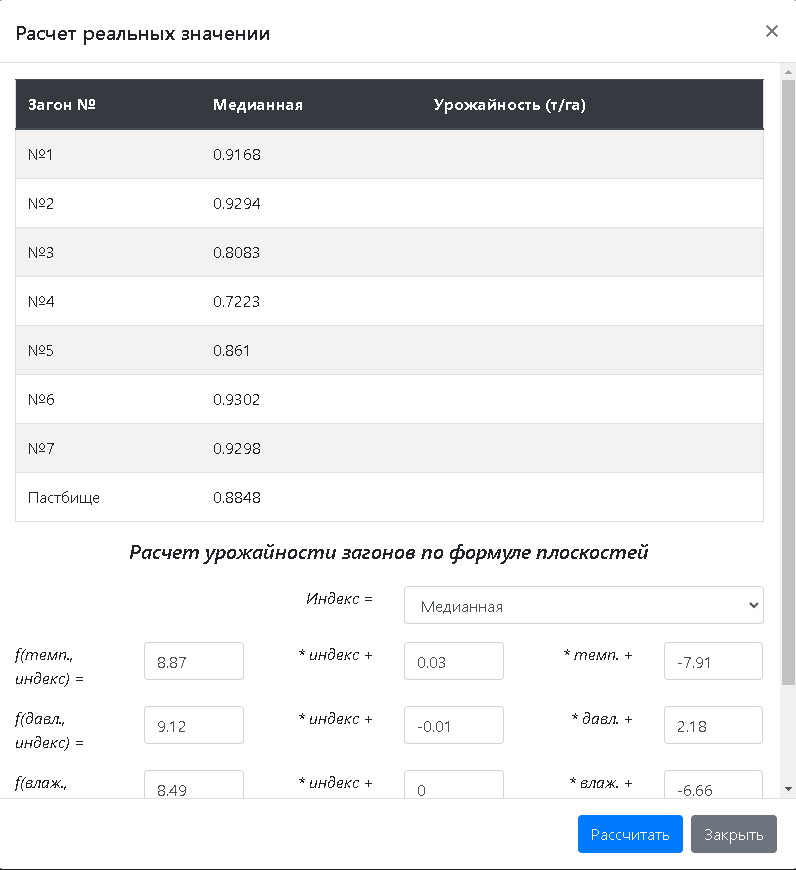
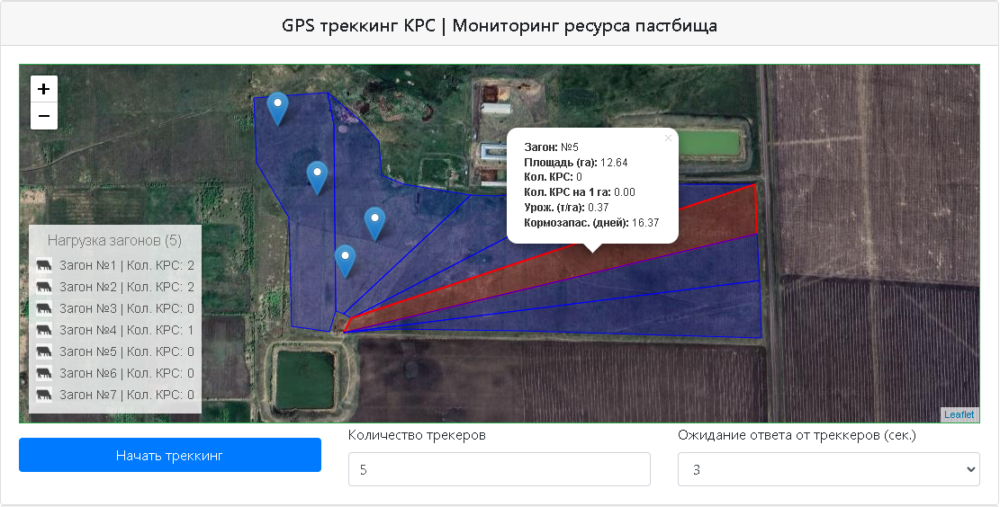
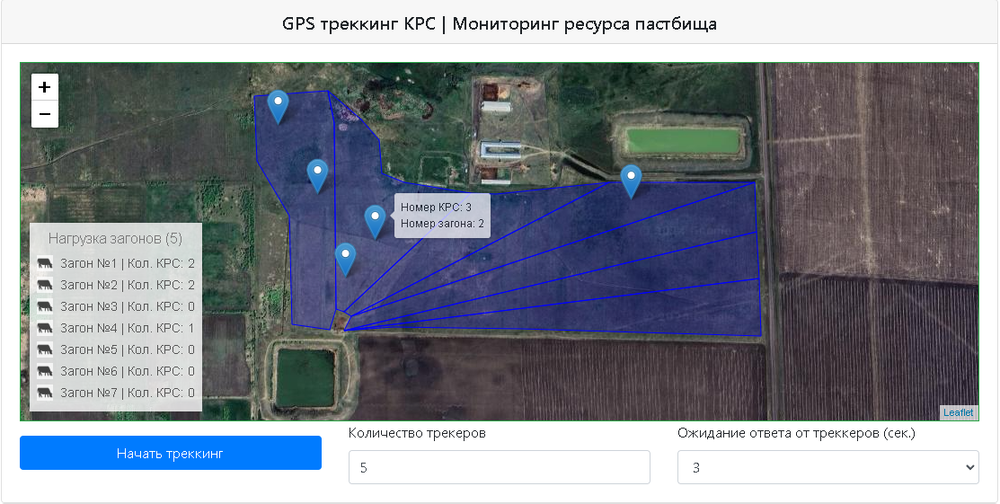
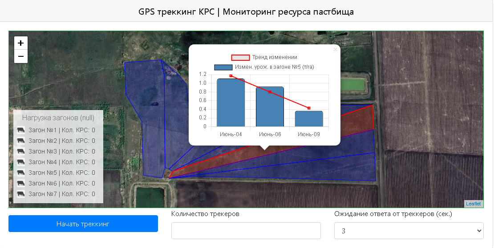
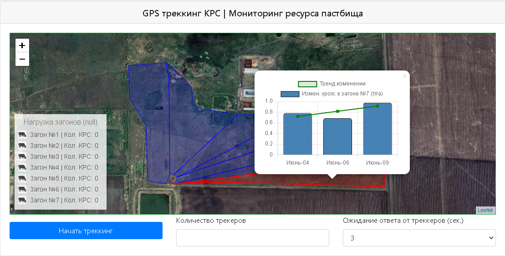

# Pasture Resource and Cattle grazzing Management System

### Description of the System  

<table>
  <tr>
    <td align="center">
       
      Step 1: Initial screen
    </td>
    <td align="center">
       
      Step 2: Filling blanks with required parameters
    </td>
  </tr>

  <tr>
    <td align="center">
       
      Step 3: Fetched dates
    </td>
    <td align="center">
       
      Step 4: Selecting a date
    </td>
  </tr>
    <td align="center">
       
      Step 5: Pasture RGB image
    </td>
    <td align="center">
       
      Step 6: Blank for inserting index formula
    </td>
  </tr>

  <tr>
    <td align="center">
       
      Step 7: Hints for selecting channels for creating index
    </td>
    <td align="center">
       
      Step 8: Hints for selecting channels for creating index
    </td>
  </tr>

  <tr>
    <td align="center">
       
      Step 9: Selected index formula
    </td>
    <td align="center">
       
      Step 10: Fetched index
    </td>
  </tr>

  <tr>
    <td align="center">
       
      Step 11: Cattle GPS tacking and Resource Assessing Models
    </td>
    <td align="center">
       
      Step 12: Gate contol
    </td>
  </tr>

  <tr>
    <td align="center">
       
      Step 13: Gate contol
    </td>
    <td align="center">
       
      Step 14: Pasture and Paddocks Histogram
    </td>
  </tr>

  <tr>
    <td align="center">
       
      Step 15: Manual Resource Calculator
    </td>
    <td align="center">
       
      Step 16: Manual Resource Calculator
    </td>
  </tr>

  <tr>
    <td align="center">
       
      Step 17: Quick Paddock Characteristics Overview ToolTip
    </td>
    <td align="center">
       
      Step 18: Quick Cattle Characteristics Overview ToolTip
    </td>
  </tr>

  <tr>
    <td align="center">
       
      Step 19: Paddock's Resource Trend
    </td>
    <td align="center">
       
      Step 20: Paddock's Resource Trend
    </td>
  </tr>

  <tr>
    <td align="center">
       
      Step 21: Models's Verdict
    </td>
    <td align="center">
       
      Step 22: Models's Verdict
    </td>
  </tr>

</table>

### Hardware overview  

 

<table>

  <tr>
    <td align="center">
       
      Gates
    </td>
    <td align="center">
       
      Gates
    </td>
  </tr>

</table>

<table>

  <tr>
    <td align="center">
       
      Gate control module
    </td>
    <td align="center">
       
      Main control module
    </td>
    <td align="center">
       
      Cattle control module (collar)
    </td>
  </tr>

</table>
